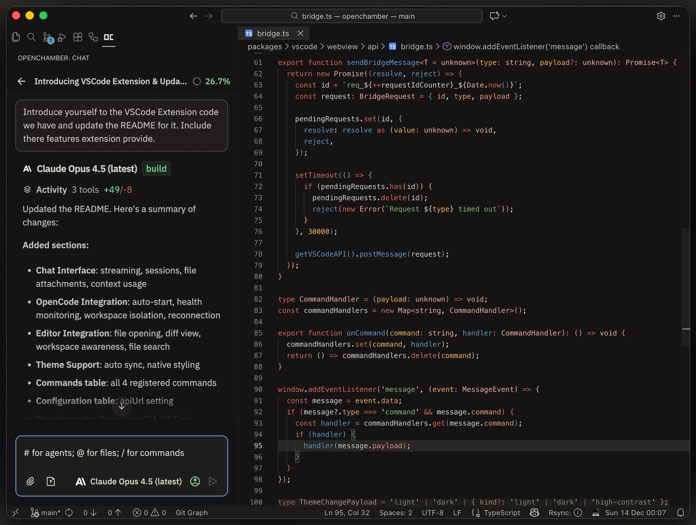

# OpenChamber

[](https://github.com/btriapitsyn/openchamber/stargazers)
[](https://github.com/btriapitsyn/openchamber/network/members)
[](https://github.com/btriapitsyn/openchamber/releases/latest)
[](https://opencode.ai)

Web and desktop interface for the [OpenCode](https://opencode.ai) AI coding agent. Works alongside the OpenCode TUI.

The OpenCode team is actively working on their own desktop app. I still decided to release this project as a fan-made alternative.

It was entirely built with OpenCode tool - first with the TUI version, then with the first usable version of OpenChamber, which I then used to build the rest.

The whole project was built entirely with AI coding agents under my supervision. It started as a hobby project and proof of concept that AI agents can create genuinely usable software.


<details>
<summary>More screenshots</summary>



<p>


</p>

</details>

## Why use OpenChamber?

- **Cross-device continuity**: Start in TUI, continue on tablet/phone, return to terminal - same session
- **Remote access**: Use OpenCode from anywhere via browser
- **Familiarity**: A visual alternative for developers who prefer GUI workflows

## Features

### Core (all apps versions)

- Integrated terminal
- Git operations with identity management and AI commit message generation
- Smart tool visualization (inline diffs, file trees, results highlighting)
- Rich permission cards with syntax-highlighted operation previews
- Per-agent permission modes (ask/allow/full) per session
- Branchable conversations: start a new session from any assistant response
- Task tracker UI with live progress and tool summaries
- Model selection UX: favorites, recents, and configurable tool output density
- UI scaling controls (font size and spacing)
- Session auto-cleanup with configurable retention
- Memory optimizations with LRU eviction

### Web / PWA

- Mobile-first UI with gestures and optimized terminal controls
- Self-serve web updates (no CLI required)
- Update and restart keeps previous server settings (port/password)

### Desktop (macOS)

- Native macOS menu bar integration with app actions
- First-launch directory picker to minimize permission prompts

### VS Code Extension

- Editor-integrated file picker and click-to-open from tool output
- In-extension Settings access and theme mapping

## Installation

### VS Code Extension

Install from [VS Code Marketplace](https://marketplace.visualstudio.com/items?itemName=fedaykindev.openchamber) or search "OpenChamber" in Extensions.

### CLI (Web Server)

```bash
# Quick install (auto-detects your package manager)
curl -fsSL https://raw.githubusercontent.com/btriapitsyn/openchamber/main/scripts/install.sh | bash

# Or install manually
pnpm add -g @openchamber/web    # or npm, yarn, bun
```

```bash
openchamber                          # Start on port 3000
openchamber --port 8080              # Custom port
openchamber --daemon                 # Background mode
openchamber --ui-password secret     # Password-protect UI
openchamber stop                     # Stop server
openchamber update                   # Update to latest version
```

### Desktop App (macOS)

Download from [Releases](https://github.com/btriapitsyn/openchamber/releases).

## Prerequisites

- [OpenCode CLI](https://opencode.ai) installed
- Node.js 20+ (for web version)

See [CONTRIBUTING.md](./CONTRIBUTING.md) for guidelines.

## Tech Stack

React 19, TypeScript, Vite 7, Tailwind CSS v4, Zustand, Radix UI, @opencode-ai/sdk, Express, Tauri (desktop)

## Acknowledgments

Independent project, not affiliated with OpenCode team.

**Special thanks to:**

- [OpenCode](https://opencode.ai) - For the excellent API and extensible architecture
- [Flexoki](https://github.com/kepano/flexoki) - Beautiful color scheme by [Steph Ango](https://stephango.com/flexoki)
- [Pierre](https://pierrejs-docs.vercel.app/) - Fast, beautiful diff viewer with syntax highlighting
- [Tauri](https://github.com/tauri-apps/tauri) - Desktop application framework
- [David Hill](https://x.com/iamdavidhill) - who inspired me to release this without [overthinking](https://x.com/iamdavidhill/status/1993648326450020746?s=20)
- My wife, who created a beautiful firework animation for the app while testing it for the first time

## License

MIT
